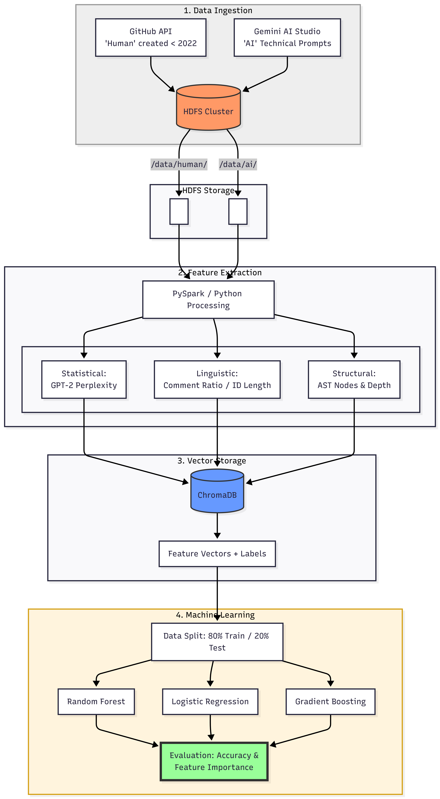

# AI-Generated Code Detector

This is an end-to-end data pipeline that detects whether Python source code was written by a human or generated by an LLM, combining AST analysis, linguistic features, and machine learning across a distributed HDFS storage layer.

---

## Architecture




## Pipeline Phases

### 1. Data Ingestion
- **Human data**: Python scripts scraped from GitHub using a temporal filter (`created:<2022-01-01`, `stars:>50`) to ensure pre-LLM ground truth, stored in HDFS under `/data/human/`
- **AI data**: 100 Python scripts generated via the gemini-3-flash-preview API across 15 diverse technical topics, stored in HDFS under `/data/ai/`

### 2. Feature Engineering — 3-Pillar Analysis

Each script is processed into a **5-dimensional feature vector**:

| Pillar | Feature | Logic |
|---|---|---|
| Statistical | GPT-2 Perplexity | AI code is more predictable → lower perplexity |
| Linguistic | Comment Ratio | AI comments more consistently |
| Linguistic | Avg Identifier Length | AI uses longer, more descriptive names |
| Structural | AST Node Count | AI generates structurally larger code |
| Structural | AST Max Depth | AI produces more balanced tree structures |

### 3. Vector Storage
Feature vectors and labels (`0` = Human, `1` = AI) are stored in **ChromaDB** for fast retrieval and ML training.

### 4. Machine Learning

| Model | Accuracy |
|---|---|
| Logistic Regression | 45.45% |
| Gradient Boosting | 69.70% |
| **Random Forest** | **75.76%** |

**Feature importance (Random Forest):**

| Feature | Importance |
|---|---|
| Comment Ratio | 32.96% |
| AST Nodes | 27.68% |
| Perplexity | 17.76% |
| Identifier Length | 12.95% |
| AST Depth | 8.66% |

---

## Setup & Usage

### Prerequisites
- Python 3.10+
- Docker Desktop
- Java 8+ (for PySpark)

### 1. Clone & configure

```bash
git clone https://github.com/your-username/ai-code-detector.git
cd ai-code-detector
cp .env.example .env
# Fill in your GITHUB_TOKEN, GEMINI_API_KEY in .env
```

### 2. Start HDFS cluster

```bash
cd docker && docker-compose up -d
```

### 3. Create virtual environment & install dependencies

```bash
python -m venv venv
venv\Scripts\activate        # Windows
pip install -r requirements.txt
```

### 4. Run the pipeline

```bash
# Full pipeline
python run_pipeline.py

# Or phase by phase
python run_pipeline.py --phase ingestion
python run_pipeline.py --phase features
python run_pipeline.py --phase training
```
